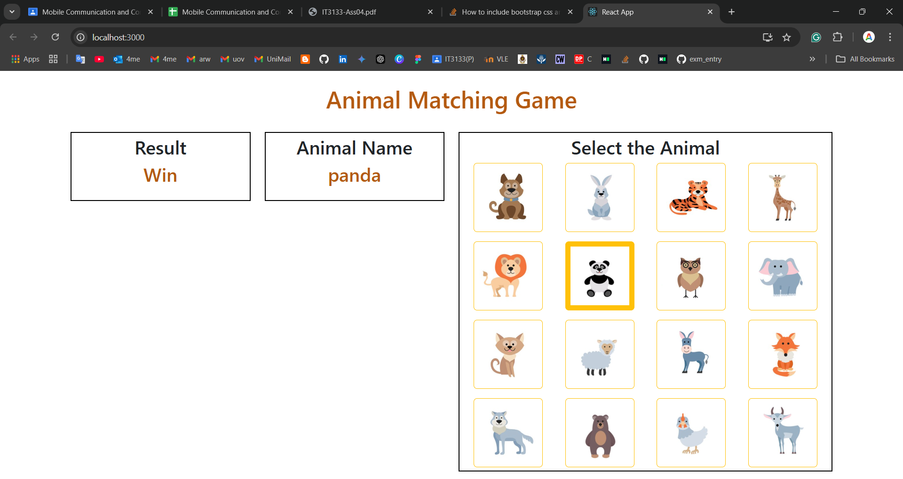
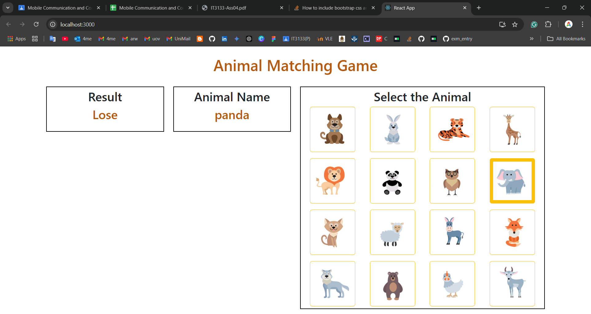

# IT3133-Assignment04
### 2020ICT101

## Question: 
You are requested to develop a game for children. The game's main objective is to enhance children's object recognition and language abilities. On the left side of the game page, an animal name will be displayed then the player has to click the correct animal image among 16 animals. If the player made the correct choice, the result shows win otherwise lose.

## Output

